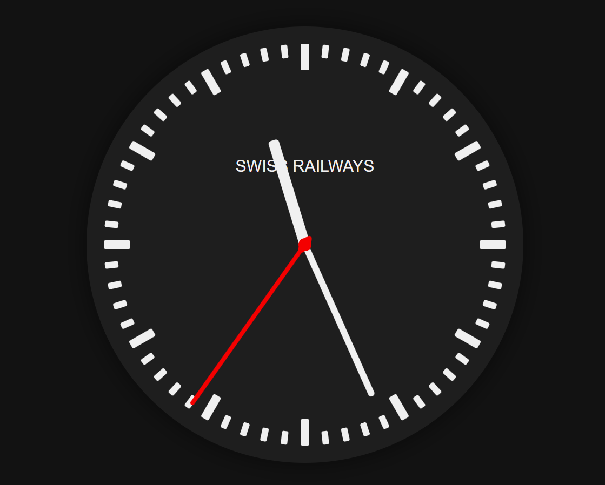
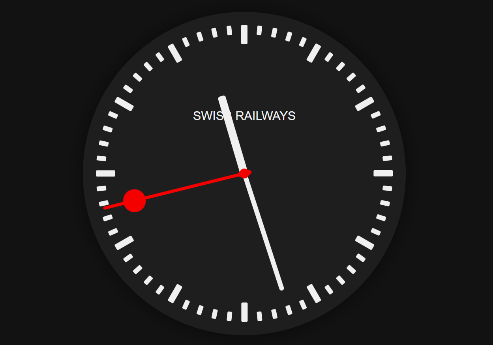
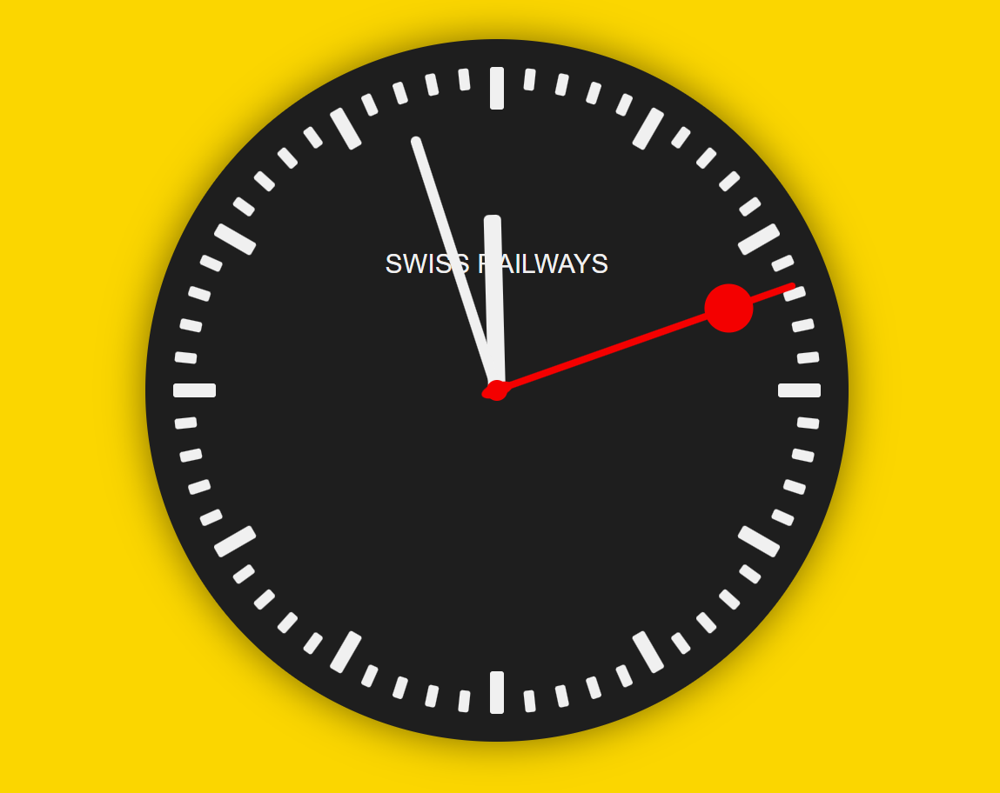
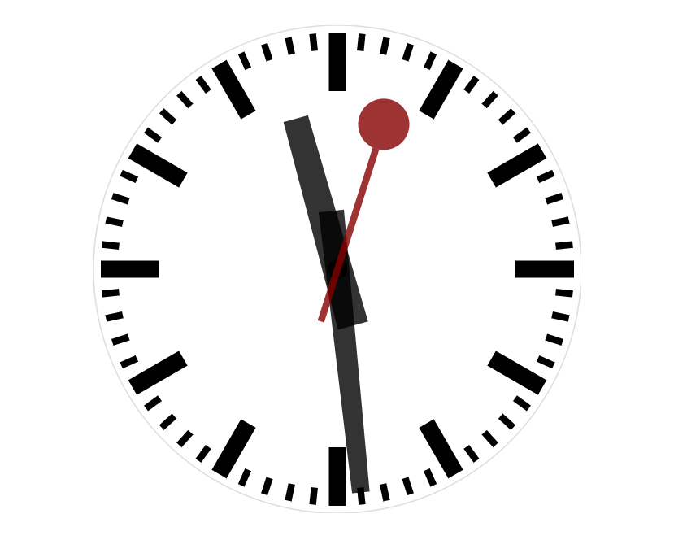

# Train Station Clocks

This is a collection of clocks with a short little stop at the top in html, similar to the famous swiss train station clock by Hans Hilfiker.

## Screenshots

sonnet-refined:

sonnet-refined2 (red ball on second handle):

sonnet-refined2 (indicating < 5 minutes left to the full hour):

wiki-refined (original proportions, from a linked codepen on wikipedia):

## Features

Swiss train clocks have these 'unusual' features:

- **Smooth movement** of the second handle
- Second handle **stops at the top** for a while, moves the minute handle, and then continues (originally waiting for a 'minute impulse' from the master clock)

Additionally, the `sonnet-refined1/2` versions **changes color 5 minutes before the hour ends**, from black to a friendly yellow. This should remind you that it's time to come to and end.

The `wiki(-refined)` versions have exactly the same proportions as the original, but are under copyright. They also **change colors 5 minutes before**, and additionally **aligns updates** to the full second of the system clock.

All clocks show system time, except `wiki-refined2` which uses network time from cloudflare.

## Usage

There are two variants:
1. Open the files from GitHub Pages, links [below](#how-to-show-from-github-directly)
1. Clone this repo, open the file(s) in `./html/` locally

## How to show from GitHub directly

These are deployed via GitHub Pages:

- sonnet-refined: https://tnglemongrass.github.io/swiss-railway-clock/sonnet.html
- sonnet-refined2: https://tnglemongrass.github.io/swiss-railway-clock/sonnet-refined.html
- wiki-refined: https://tnglemongrass.github.io/swiss-railway-clock/wiki-refined.html
- wiki-refined2: https://tnglemongrass.github.io/swiss-railway-clock/wiki-refined2.html

## Development

All files are located in `docs/` folder, to allow deployment via Github Pages.

## Links

- https://cssanimation.rocks/clocks/
- https://de.wikipedia.org/wiki/Schweizer_Bahnhofsuhr
- https://de.wikipedia.org/wiki/Bahnhofsuhr
- https://claude.ai/new
